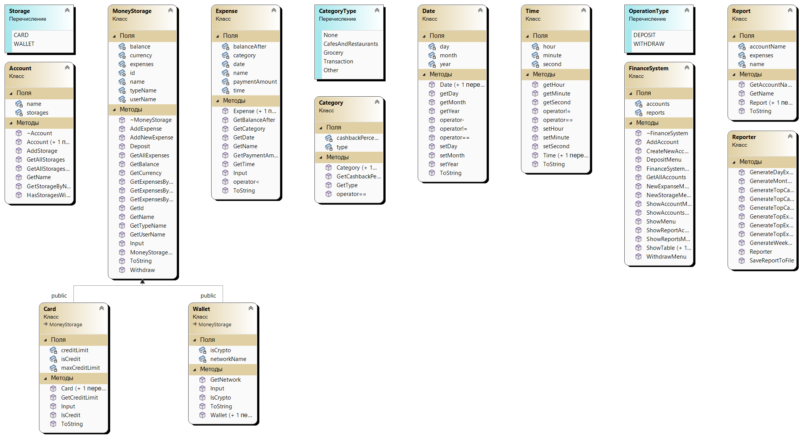
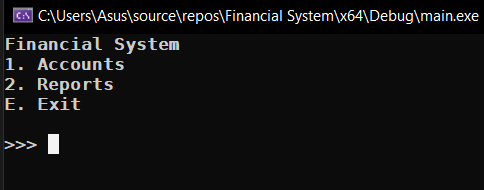
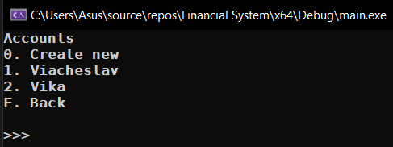
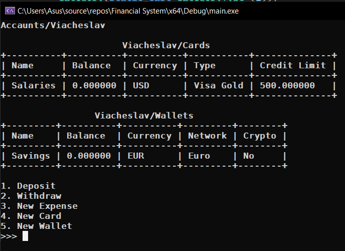
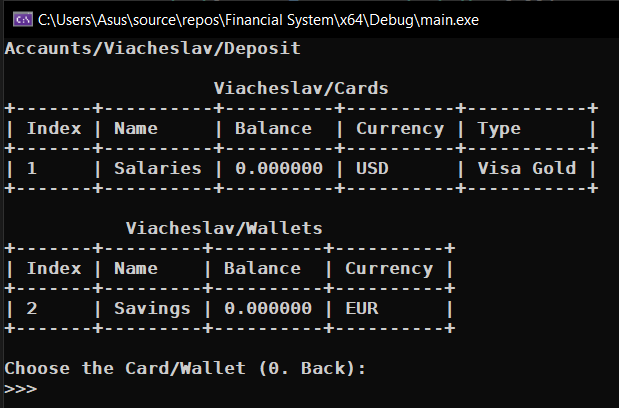
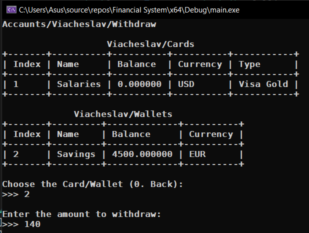
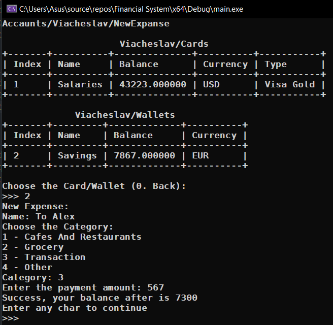
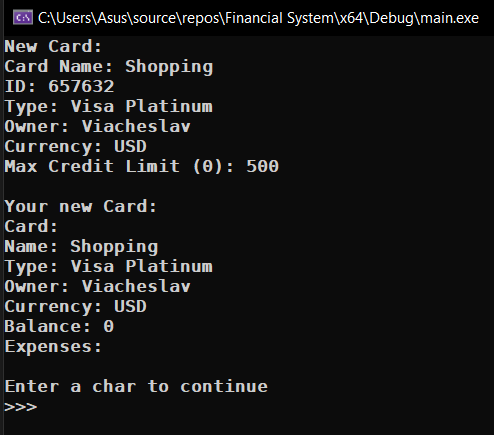
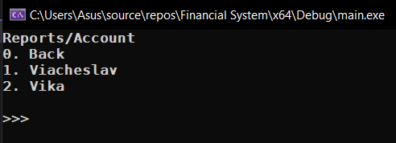
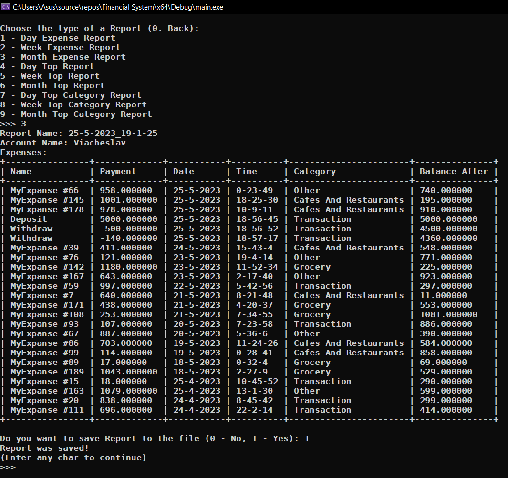

# Financial System

Архитектура фин. системы

Пример отчета:
* [25-5-2023_19-1-25.txt](main/25-5-2023_19-1-25.txt)

Main cpp file:
- [main.cpp](main/main.cpp)

Main classes:
* [Account.h](main/Account.h)
* [Account.cpp](main/Account.cpp)

- [Card.h](main/Card.h)
- [Card.cpp](main/Card.cpp)

* [Category.h](main/Category.h)
* [Category.cpp](main/Category.cpp)

- [Date.h](main/Date.h)
- [Date.cpp](main/Date.cpp)

* [Expense.h](main/Expense.h)
* [Expense.cpp](main/Expense.cpp)

- [FinanceSystem.h](main/FinanceSystem.h)
- [FinanceSystem.cpp](main/FinanceSystem.cpp)

* [MoneyStorage.h](main/MoneyStorage.h)
* [MoneyStorage.cpp](main/MoneyStorage.cpp)

- [Report.h](main/Report.h)
- [Report.cpp](main/Report.cpp)

* [Reporter.h](main/Reporter.h)
* [Reporter.cpp](main/Reporter.cpp)

- [Time.h](main/Time.h)
- [Time.cpp](main/Time.cpp)

* [Wallet.h](main/Wallet.h)
* [Wallet.cpp](main/Wallet.cpp)

Other classes:
- [functions.h](main/Report.h)

* [ConsoleTable.h](main/ConsoleTable.h)
* [ConsoleTable.cpp](main/ConsoleTable.cpp)

    <h2>Simple Class Diagram</h2>
    

    

    <h2>Main Menu</h2>
    

    

    <h2>Accounts Menu</h2>
    

    

    <h2>Account Menu</h2>
    

    

    <h2>Deposit Menu</h2>
    

    

    <h2>Withdraw Menu</h2>
    

    

    <h2>New Expense Menu</h2>
    

    

    <h2>New Card Menu</h2>
    

    

    <h2>Reports Menu</h2>
    

    

    <h2>Account Reports Menu</h2>
    

    

